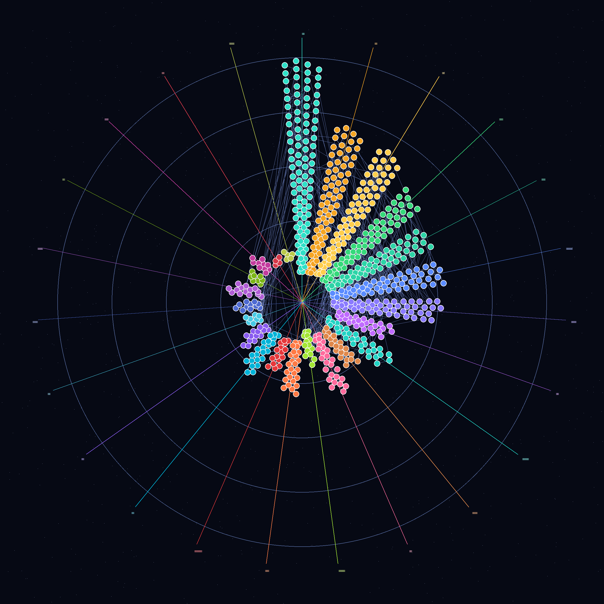

<div align="center">

# 🌌 数学天赋星图 · Math Skill Tree

**给数学学习一张能看清脉络的全局星图**

[预览 Radial 星图](#-在线预览) · [预览 Ordered 技能树](#-在线预览) · [快速开始](#-快速开始) · [玩法说明](#-怎么玩)




</div>

---

## ✨ 项目亮点

> **702 颗星体 × 23 个星座领域 × 1002 条知识脉络**

| 特性 | 说明 |
|:---:|:---|
| 🗺️ **双视图布局** | 「径向星图」星系沉浸感 + 「有序技能树」按年龄递进排列 |
| 🔗 **真·依赖图** | 硬性前置解锁机制，点亮一颗星才能激活后续技能脉络 |
| 🎨 **霓虹星座美学** | Canvas 2D 手绘质感，呼吸光晕、动态虚线流动、稀有度分级 |
| 🇨🇳 **课标对齐** | 内置人教版小学数学课标标记，一键筛选课标内容 |
| 🔍 **多维筛选** | 按领域、年龄段、关键词搜索、单独星座切换 |
| 💾 **本地进度** | 进度自动保存至 localStorage，刷新不丢失 |
| 🚀 **零依赖部署** | 纯静态 HTML，无需构建，上传即可运行 |
| 📱 **高分辨率适配** | DPR 自适应渲染，支持 10× 缩放查看节点花纹细节 |

---

## 🌠 在线预览

> 部署到 GitHub Pages 后，访问以下地址即可体验：

| 视图 | 路径 | 说明 |
|:---|:---|:---|
| 🌟 **径向星图 Galaxy 2D** | `/index.html` | 23 条彩色射线构成知识宇宙，从中心向外 = 年龄与深度递增 |
| 📊 **有序技能树** | `/index.ordered.html` | 按 4–6 / 7–9 / 10–12 / 13+ 岁排列成「学习之河」 |

---

## 🎮 怎么玩

### 基础操作

| 操作 | 效果 |
|:---|:---|
| 🖱️ **拖拽画布** | 平移视图，漫游知识星图 |
| 🎯 **滚轮缩放** | 放大查看节点符号细节（最高 10×），缩小浏览全局 |
| ⭐ **点击星体** | 查看知识点详情：描述、掌握证据、评估提示、前后置关系 |
| 💡 **点击「✦ 点亮」** | 当所有硬性前置都掌握后，即可点亮该星体，激活脉络 |
| 🔎 **侧边栏筛选** | 按星座领域、年龄段、课标、关键词快速定位 |
| 🎯 **点图例** | 点击左侧星座图例快速筛选单领域 |

### 星体状态

```
🔘 青铜暗盘 ── 未解锁（有未掌握的硬性前置）
🔵 青色呼吸 ── 可学    （所有前置已点亮，等待学习）
💜 紫罗兰霓虹 ── 已掌握（点燃后点亮外圈稀有度光环）
```

### 稀有度体系

稀有度根据知识图谱中心度（连接边数）自动计算：

| 等级 | 颜色 | 含义 |
|:---:|:---:|:---|
| ⚪ 普通 | `#5b6577` | 一般概念或边端节点 |
| 🔵 稀有 | `#4f9dff` | 连接多个子主题的桥梁知识 |
| 🟣 史诗 | `#b86bff` | 领域核心概念，辐射面广 |
| 🟡 传说 | `#ffcf4d` | 整个数学体系的中枢基石 |

---

## 🚀 快速开始

### 方式一：GitHub Pages 一键部署（推荐）

1. **Fork** 本仓库到你的 GitHub 账号
2. 进入仓库 **Settings → Pages**
3. **Source** 选择 `Deploy from a branch`
4. **Branch** 选择 `main` / `master`，目录选 `/ (root)`，保存
5. 等待 1~2 分钟后访问 `https://<你的用户名>.github.io/math-skill-tree/` ✅

### 方式二：本地预览

因为用到了 `fetch()` 加载 JSON，不能直接双击 `index.html`（CORS 限制），需要一个本地静态服务器：

```bash
# Python 3（推荐，零安装）
python -m http.server 8000

# Node.js（需安装 http-server）
npx http-server -p 8000

# 或 VS Code Live Server 插件
# 右键 index.html → Open with Live Server
```

然后浏览器打开 `http://127.0.0.1:8000/index.html`

---

## 📁 项目结构

```
math-skill-tree/
├── index.html              # 🌀 主入口：径向星图 Galaxy 2D
├── index.ordered.html      # 📊 有序视图：按年龄技能树排列
├── preview-radial.png      # 🖼️ README 预览图
├── preview-ordered.png     # 🖼️ 有序视图预览图
│
├── data/                   # 📦 知识图谱数据
│   ├── math-topics.json        # 702 个知识点（含中文翻译/课标/年龄段）
│   └── math-dependencies.json  # 1002 条依赖边（hard/soft 前置）
│
├── assets/                 # 🎨 静态资源
│   ├── compass.png             # 中心罗盘（金色复古风）
│   ├── node.png / nodec.png    # 星体圆盘（青铜暗盘 / 金光亮盘）
│   ├── left.png                # 侧边栏羊皮纸背景
│   ├── orb_cyan/orange/pink/purple.png  # 图例辉光球
│   ├── mtf-sprite.svg          # SVG 符号精灵图（702 个数学符号）
│   └── symbols/                # 独立 SVG 符号源文件
│
├── vendor/                 # 📚 第三方库
│   └── vis-network.min.js      # 有序视图用可视化引擎
│
└── scripts/                # 🔧 数据生成脚本（可选，开发者用）
    ├── prepare_math.py         # 数学知识点预处理
    ├── augment_curriculum.py   # 课标数据对齐
    └── augment_secondary.py    # 中学内容扩展
```

---

## 🧮 知识图谱规模

| 指标 | 数值 |
|:---|---:|
| 🌟 知识点总数 | **702** |
| 🔗 依赖边总数 | **1002** |
| 🏛️ 知识领域数 | **23** |
| 📘 中国课标标记 | **人教版小学数学** |
| 📐 覆盖年龄段 | **4 – 18 岁** |
| 🎯 节点稀有度 | 普通 / 稀有 / 史诗 / 传说（基于中心度自动划分） |

### 23 个星座领域

> 每条彩色射线就是一个独立的知识星座

| 领域 | 颜色 | 示例星体 |
|:---|:---:|:---|
| 计数与基数 | 🟢 | 数到 10、一一对应、比较数量 |
| 加减法 | 🟢 | 进位加法、退位减法、凑十法 |
| 乘除法 | 🟢 | 九九乘法表、长除法、因数分解 |
| 分数 | 🟡 | 分数意义、通分约分、分数四则 |
| 比与比例 | 🟠 | 正比例、反比例、比例尺 |
| 数位与位值 | 🔵 | 十进制、位值表、科学计数法 |
| 数与式 | 🟠 | 整式、因式分解、分式 |
| 方程与不等式 | 🔴 | 一元一次方程、二次方程、不等式组 |
| 函数 | 🔵 | 一次函数、二次函数、指数对数函数 |
| 微积分 | 🟣 | 极限、导数、积分、微分方程 |
| 几何 | 🟢 | 平面图形、全等相似、面积周长 |
| 立体几何 | 🔵 | 柱体锥体、表面积体积、三视图 |
| 解析几何 | 🟣 | 直线方程、圆锥曲线、极坐标 |
| 三角 | 🟣 | 锐角三角、弧度制、三角恒等变换 |
| 向量 | 🟢 | 向量运算、点积叉积、线性组合 |
| 数列 | 🟢 | 等差等比、通项公式、数列求和 |
| 复数 | 🔴 | 复数运算、复平面、欧拉公式 |
| 测量 | 🟠 | 长度质量容积、时间货币、单位换算 |
| 数据与统计 | 🟢 | 条形/折线/饼图、平均数、抽样统计 |
| 概率 | 🩷 | 古典概型、条件概率、分布列 |
| 计数原理 | 🟡 | 排列组合、二项式定理、容斥原理 |
| 数学思维 | 🟣 | 归纳演绎、抽象建模、逻辑推理 |
| 代数 | 🟣 | 变量替换、恒等变形、代数结构 |

---

## 🎨 视觉设计哲学

### 星系径向布局

中心是整个数学宇宙的核心基石，知识点沿扇形射线向外辐射：

- **由内到外** = 年龄与学习顺序递增
- **同一射线由内到外** = 同一领域知识纵向深化
- **扇形比例** = 该领域知识点数量的加权平方根（避免极端比例）

### 性能优化

为了让 700+ 节点在 Canvas 上 60fps 流畅运行，做了这些工程优化：

| 技术方案 | 效果 |
|:---|:---|
| **烘焙光球 Sprite** | 3 张预着色径向渐变 canvas，运行时 drawImage，零实时 shadowBlur |
| **SVG 符号预着色** | 使用 `source-in` 合成一次性把符号染成 4 种颜色，避免每帧重绘 SVG |
| **选择性流动虚线** | 只对选中节点的少数邻居边做 setLineDash 偏移，700 节点零卡顿 |
| **扇形渐变缓存** | 领域背景渐变只计算一次，布局不变时直接复用 |
| **解锁状态缓存** | 可用性/状态双缓存 Map，避免每次渲染 O(N×D) 全量扫描 |

---

## 🛠 技术栈

| 层级 | 技术 |
|:---|:---|
| 渲染引擎 | **HTML5 Canvas 2D**（径向星图）+ **vis-network**（有序视图） |
| 资源格式 | **PNG Sprite** + **SVG Symbol** + **OpenType 字体** |
| 数据加载 | 原生 `fetch()` + 相对路径 JSON |
| 状态存储 | `localStorage`（无需后端） |
| 动画 | `requestAnimationFrame` + CSS transition |
| 构建 | **零构建**，纯静态文件直接部署 |

---

## 🤝 贡献指南

欢迎通过 Issue / PR 参与贡献！

### 你可以贡献的方向

- 🧮 **补充知识点**：修复描述、完善掌握证据、补充评估提示
- 🇨🇳 **校对中文翻译**：标记为「⚠ 待校对」的节点需要人工核实
- 🎒 **扩展课标**：增加苏教版、北师大版等其他课标标记
- 🎨 **UI/UX 改进**：动画优化、移动端适配、无障碍访问
- 🐛 **Bug 修复**：发现问题请提 Issue 附截图/复现步骤

### 开发环境

```bash
# 1. Fork + Clone
git clone https://github.com/<你的用户名>/math-skill-tree.git
cd math-skill-tree

# 2. 起一个本地服务器
python -m http.server 8000

# 3. 改代码 → 浏览器刷新预览 → 提 PR
```

---

## 📄 开源协议

[MIT License](LICENSE) © 数学天赋星图贡献者

> 数据层基于 [Marble Skill Taxonomy](https://github.com/…) 公开数据集构建，
> 中文翻译与课标对齐内容遵循 CC BY-SA 4.0。

---

<div align="center">

**如果这个项目对你有启发，请给它一颗 ⭐ Star**

**给数学学习一张全局地图，让每一步都看得见方向。**


</div>
